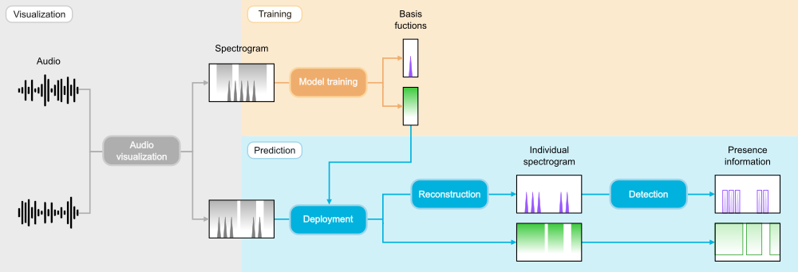
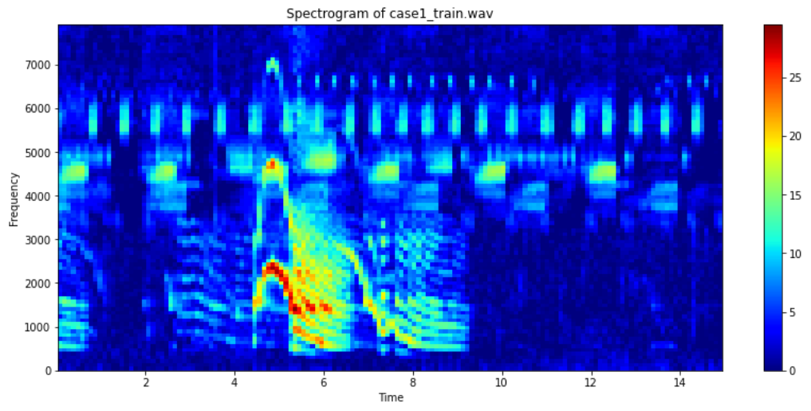
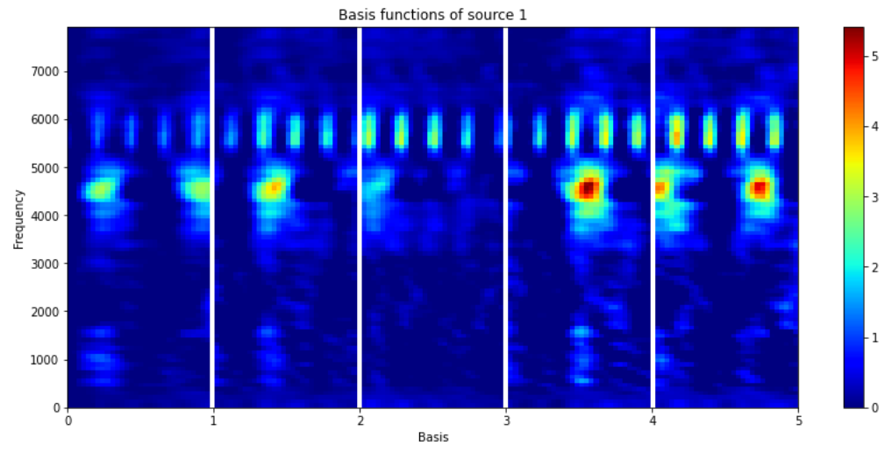
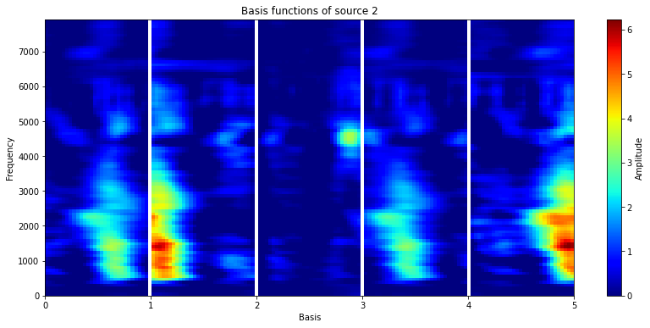
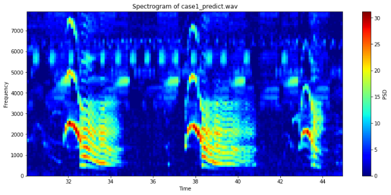
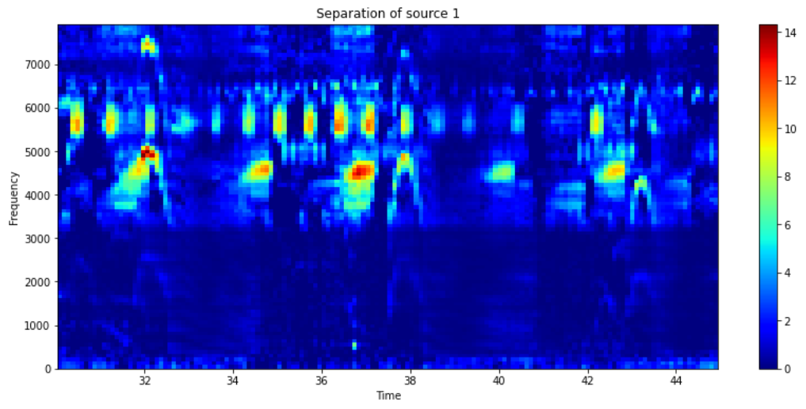
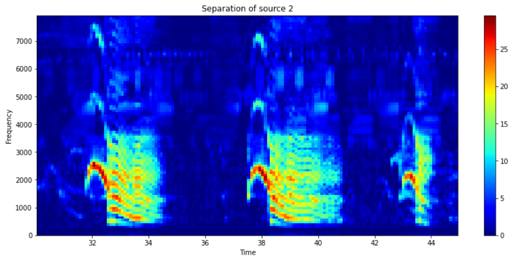
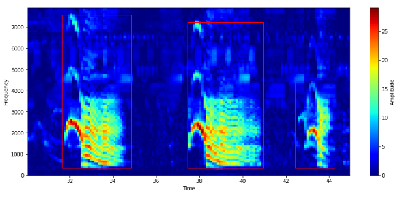

<div align="center">
    
</div></br>

**soundscape_IR** is a python-based toolbox of soundscape information retrieval, aiming to assist in the analysis of a large amount of audio data. 
The toolbox has two primary modules: (1) visualization of long-duration recordings (based on the MATLAB package Soundscape Viewer) and (2) audio source separation.

[](
https://doi.org/10.1038/s41598-017-04790-7)

## Installation
Dependencies:
- Python >= 3.6
- scikit-learn == 0.23

To install **soundscape_IR**, clone the repository in your Python environment.
```bash
# Clone soundscape_IR from GitHub @schonkopf
git clone https://github.com/schonkopf/soundscape_IR.git
```
Then, install the [requirements.txt](https://github.com/schonkopf/soundscape_IR/blob/master/requirements.txt) in the package folder for installing required packages.
```bash
# Install required packages
cd soundscape_IR
pip install -r requirements.txt
```

## Quick start
<div align="center">

</div>

<div>
   <a href="https://colab.research.google.com/drive/1xPJR2LbC-5hOGK5d25u6_6zmSznJ3kHo?usp=sharing"></a>
</div></br>

<details open>
<summary>Audio visualization</summary>

**soundscape_IR** provides a function ```audio_visualization``` to transform an audio into a spectrogram on the hertz or mel scale. It also enables the use of Welch’s averaging method and spectrogram prewhitening in noise reduction. This example uses a short audio clip of sika deer calls and insect calls to demonstrate the ecoacoustic application of source separation.
 
```python
from soundscape_IR.soundscape_viewer import audio_visualization

# Define spectrogram parameters
sound_train = audio_visualization(filename='case1_train.wav', path='./data/wav/', offset_read=0, duration_read=15,
                                  FFT_size=512, time_resolution=0.1, prewhiten_percent=10, f_range=[0,8000])
```

</details>

<details open>
<summary>Model training</summary>
    
After preparing the training spectrgram, we can train the source separation model with ```supervised_nmf```. NMF learns a set of basis functions to reconstruct the training spectrogram. In **soundscape_IR**, we can apply PC-NMF to separate the basis functions into two groups according to their source-specific periodicity. In this example, one group of basis funcitons is associated with deer call (mainly < 4 kHz) and another group is associated with noise (mainly > 3.5 kHz). Save the model for further applications.

```python
from soundscape_IR.soundscape_viewer import supervised_nmf

# Define model parameters
model=supervised_nmf(feature_length=30, basis_num=10)

# Feature learning
model.learn_feature(input_data=sound_train.data, f=sound_train.f, method='PCNMF')

# Plot the basis functions of two sound source
model.plot_nmf(plot_type='W', source=1)
model.plot_nmf(plot_type='W', source=2)

# Save the model
model.save_model(filename='./data/model/deer_model.mat')
```
 

</details>

<details open>
<summary>Deployment and spectrogram reconstruction</summary>   

Generate another spectrogram for testing the source separation model.

```python
# Prepare a spectrogram
sound_predict=audio_visualization(filename='case1_predict.wav', path='./data/wav/', offset_read=30, duration_read=15,
                                    FFT_size=512, time_resolution=0.1, prewhiten_percent=10, f_range=[0,8000])
```   

  
Load the saved model and perform source separation. After the prediction procedure, plot the reconstructed spectrograms to evaluate the separation of deer calls and noise.
    
```python
# Deploy the model
model=supervised_nmf()
model.load_model(filename='./data/model/deer_model.mat')
model.supervised_separation(input_data=sound_predict.data, f=sound_predict.f)

# View individual reconstructed spectrogram
model.plot_nmf(plot_type = 'separation', source = 1)
model.plot_nmf(plot_type = 'separation', source = 2)
```  


</details>

<details open>
<summary>Presence detection</summary>
    
With the reconstructed spectrogram, we can use the function ```spectrogram_detection``` to detect the presence of target signals (e.g., deer calls). This function will generate a txt file contains the beginning time, ending time, minimum frequency, and maximum frequency of each detected call. Explore the detection result in [Raven software](https://ravensoundsoftware.com/).
    
```python
from soundscape_IR.soundscape_viewer import spectrogram_detection

# Choose the source for signal detection
source_num=2
    
# Define the detection parameters
sp=spectrogram_detection(model.separation[source_num-1], model.f, threshold=5.5, smooth=1, minimum_interval=0.5, 
                           filename='deer_detection.txt', path='./data/txt/')
```

</details>

<details open>
<summary>More tutorials</summary>
    - [Demo of Soundscape Viewer](https://github.com/schonkopf/soundscape_IR/blob/master/docs/tutorials/Demo_of_soundscape_information_retrieval.ipynb)
    - [Demo of audio source separation - Detecting deer calls from tropical forest soundscapes](https://github.com/schonkopf/soundscape_IR/blob/master/docs/tutorials/Demo_of_soundscape_IR_Case_study_I.ipynb)
    - [Demo of audio source separation - Learning the diversity of underwater sounds from subtropical estuary soundscapes](https://github.com/schonkopf/soundscape_IR/blob/master/docs/tutorials/Demo_of_soundscape_IR_Case_study_II.ipynb)
</details>

## Currently ongoing developments
- [ ] Soundscape spatial analysis
- [ ] Extraction of inter-pulse intervals
- [ ] Plotly-based interactive plots
    
## Future works
- [ ] GPU accelaration

## Bugs report and suggestions 
If you encounter any bug or issue, please contact Tzu-Hao Lin via schonkopf@gmail.com. Suggestions are also appreciated!

## About the team
[Marine Ecoacoustics and Informatics Lab](https://meil.biodiv.tw/home)
[](https://www.facebook.com/meil.brcas)
